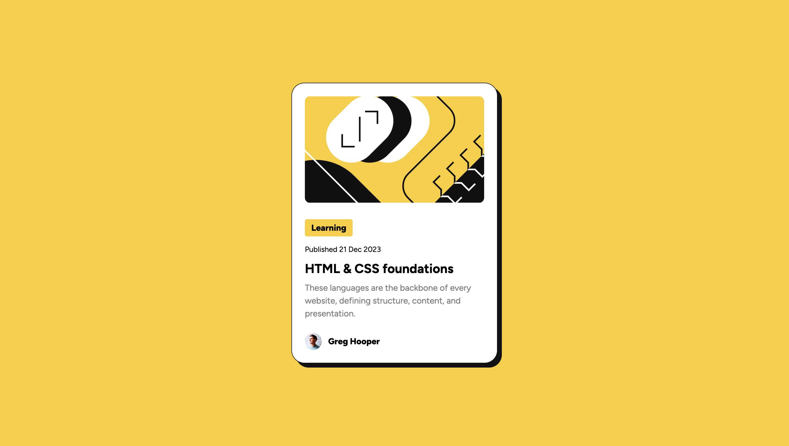

# Frontend Mentor - Blog preview card solution

This is a solution to the [Blog preview card challenge on Frontend Mentor](https://www.frontendmentor.io/challenges/blog-preview-card-ckPaj01IcS). Frontend Mentor challenges help you improve your coding skills by building realistic projects. 

## Overview

### The challenge

Users should be able to:

- See hover and focus states for all interactive elements on the page

### Screenshot

### Links

- Live Site URL: [GitHub Pages link](https://samhlking.github.io/blog-preview-card/)

## Built with

- HTML
- CSS

In about 30 minutes.

## Author

- Website - https://samuel-king.com
- Frontend Mentor - [@samhlking](https://www.frontendmentor.io/profile/samhlking)